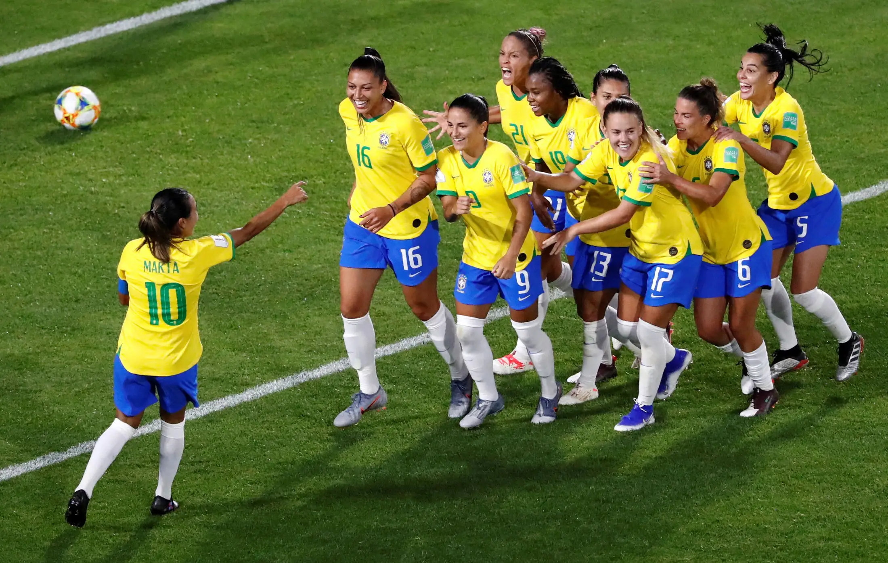
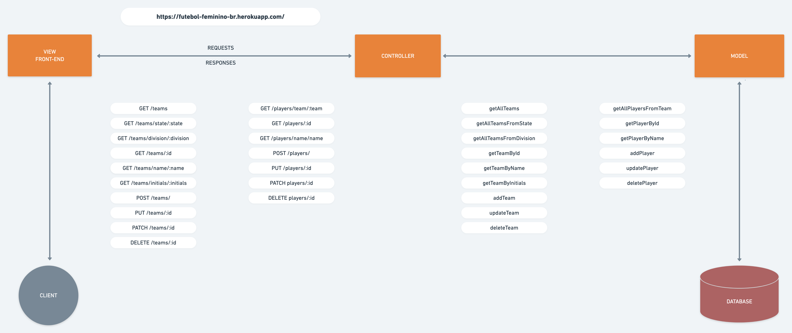

<!--  -->

# API - Futebol Feminino Brasileiro



>API Rest - CRUD com Node.js e MongoDB
>🚧 Em construção 🚧

API desenvolvida para o projeto final de conclusão do curso de Back-end da {reprograma}.

### Objetivo e motivação

A ideia de uma API com estatísticas do futebol feminino no Brasil surgiu da necessidade de um grupo de torcedoras em obter informações sobre os campeonatos, times e jogadoras. O futebol feminino no país ainda é muito sub-valorizado e os dados disponíveis publicamente sobre o esporte são escassos.

Inspirada nas diversas APIs existentes com dados do futebol masculino, criei esta que tem a intenção de reunir estatísticas para fins de consulta, cadastro e atualização sobre o futebol feminino no Brasil.

### Tecnologias utilizadas:

* Javascript
* Node.js
* Yarn
* Express.js
* MongoDB
* Mongoose
* Heroku

### Arquitetura

```bash
\--📂 SERVIDOR
            | .env
	    | .gitignore
            |  Procfile
            |  README.md
            |  yarn-lock.json
            |  package.json
            |  **server.js**
            \--📂src
                    |   **app.js**
                |
                📂---config
                    |   **db.js**
                |
                📂---controllers
                    |   **Players.js**
                    |   **Teams.js**
                |
                📂---models
                    |   **Players.js**
                    |   **Teams.js**
                |
                📂---routes
                    |   **index.js**
                    |   **Players.js**
                    |   **Teams.js**
```



### Consumindo a API

https://futebol-feminino-br.herokuapp.com/
```json
    {
        "titulo": "Futebol Feminino Brasileiro",
        "edicao": "2020"
    }
```

#### Funcionalidades e suas respectivas rotas

Método | Endpoint | Descrição
------ | ------- | ---------:
POST | /teams/ | Cadastra um time.
POST | /players/ | Cadastra uma jogadora.
GET | /teams/ | Retorna todos os times cadastrados.
GET | /players/team/:team | Retorna todas as jogadoras de um determinado time.
GET | /teams/state/:state | Retorna todos os times de um determinado estado.
GET | /teams/division/:division   | Retorna todos os times de uma série/divisão do campeonato brasileiro.
GET | /teams/:id | Retorna um único time pelo Id.
GET | /players/:id | Retorna uma única jogadora pelo Id.
GET | /teams/name/:name | Retorna um único time pelo seu nome.
GET | /players/name/:name | Retorna uma única jogadora pelo seu nome.
GET | /teams/initials/:initials | Retorna um único time pelas suas iniciais.
PUT | /teams/:id | Edita o cadastro de um time.
PUT | /players/:id | Edita o cadastro de uma jogadora.
PATCH | /teams/:id | Edita um único campo do cadastro de um time.
PATCH | /players/:id | Edita um único campo do cadastro de uma jogadora.
DELETE | /teams/:id | Deleta um time.
DELETE | /players/:id | Deleta uma jogadora.

#### Dados para cadastro na collection Teams

- Id: gerado automaticamente
- Name: String, required
- Initials: String, required, maxlenght: 3
- Division: String, required
- State: String, required
- Coach: String,
- Logo: String

#### Dados para cadastro na collection Players

- Id: gerado automaticamente
- Name: String, required
- Team: String, required
- Number: Integer, required, maxlenght: 3
- Birth: Date, required
- Position: String, required
- ProfilePhoto: String

### Rodando o projeto localmente

No terminal, clone o projeto:
`git clone https://github.com/luzialeticia/futebol-feminino-br.git`

Entre na pasta do projeto:
`cd futebol-feminino=br`

Instale as dependências:
`yarn install`

Execute:
`yarn start` ou `yarn dev`

- Crie um arquivo `.env` com as credenciais do seu Banco de Dados
- Use o Postman ou Insomnia para realizar as requisições ou utilize no seu front-end.

#### API retorna os jsons:

***Teams***
```json
[
    {
        "_id": "5fd3c2324980c10021c311eb",
        "name": "Sport Club Internacional",
        "initials": "INT",
        "division": "A1",
        "state": "RS",
        "coach": "Maurício Salgado",
        "logo": "https://logodetimes.com/times/internacional/logo-internacional-2048.png"
    } 
]
```

***Players***
```json
[
    {
        "_id": "5fd41248bb84d500214cc7ac",
        "name": "Gabi Zanotti",
        "team": "COR",
        "number": 10,
        "birth": "1985-02-28T00:00:00.000Z",
        "position": "Meia-atacante"
    }
]
```
---
Contato: leticialuzia89@gmail.com